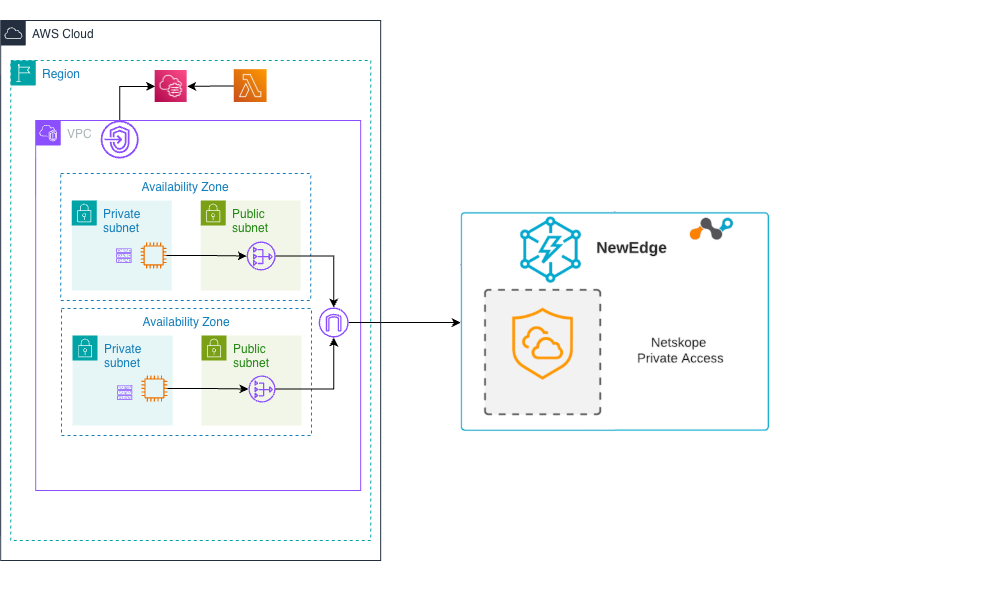

# NPA Publisher - Multi-AZ Deployment

Automated deployment of Netskope Private Access (NPA) Publishers using CloudFormation with multi-AZ redundancy and CloudFormation Custom Resources for publisher registration.

## Overview

This solution provides a highly available deployment of NPA Publishers with automatic registration to your Netskope tenant. It supports multi-AZ deployment for production redundancy and uses CloudFormation Custom Resources and AWS Systems Manager to handle the publisher setup without requiring manual intervention or exposing secrets.



## Documentation

This project includes comprehensive documentation for deployment, operations, and troubleshooting:

- **[QUICKSTART.md](docs/QUICKSTART.md)** - Get started in 10 minutes with a guided quick deployment
- **[DEPLOYMENT_GUIDE.md](docs/DEPLOYMENT_GUIDE.md)** - Complete deployment instructions with all configuration options, prerequisites, and verification steps
- **[OPERATIONS.md](docs/OPERATIONS.md)** - Operational procedures for managing running deployments (replace publishers, update AMIs, scale instances, rotate tokens, monitoring)
- **[TROUBLESHOOTING.md](docs/TROUBLESHOOTING.md)** - Common issues and solutions with diagnostic commands
- **[DEVOPS-NOTES.md](docs/DEVOPS-NOTES.md)** - Technical deep-dive into SSM integration, Lambda internals, and architecture decisions

**Quick Links:**
- New to the project? Start with **[QUICKSTART.md](docs/QUICKSTART.md)**
- Need to deploy? See **[DEPLOYMENT_GUIDE.md](docs/DEPLOYMENT_GUIDE.md)**
- Already deployed? Check **[OPERATIONS.md](docs/OPERATIONS.md)**
- Having issues? See **[TROUBLESHOOTING.md](docs/TROUBLESHOOTING.md)**

## VPC Deployment Options

The template supports two deployment modes:

### Option 1: Create New VPC 

- **Automatically creates**: VPC, Internet Gateway, NAT Gateways (2), Public & Private Subnets (2 AZs)
- **Routing**: Configured automatically for redundant internet access
- **High Availability**: Multi-AZ deployment with redundant NAT Gateways

**When creating a new VPC** (CreateNewVPC: yes):
- ✅ VPC endpoints are automatically created for Systems Manager (ssm, ec2messages, ssmmessages)
- ✅ Security group is configured with restrictive egress rules (only Netskope IPs + VPC endpoints)
- ✅ NAT Gateways remain in place for Netskope connectivity
- ✅ No internet traffic required for Systems Manager

**Parameters**:
```yaml
CreateNewVPC: yes
VPCCIDR: 10.0.0.0/16
PublicSubnetCIDR: 10.0.1.0/24
PrivateSubnetCIDR: 10.0.2.0/24
AvailabilityZone: (optional, auto-selected if not specified)
PublicSubnetCIDR2: 10.0.3.0/24
PrivateSubnetCIDR2: 10.0.4.0/24
AvailabilityZone2: (optional, auto-selected if not specified)
```

### Option 2: Use Existing VPC 

- **Requires**: Existing VPC with private subnets (2 AZs) that have NAT Gateways and relevant route tables
- **High Availability**: Deploy instances across multiple availability zones
- **DNS** VPC must have DNS hostnames and DNS support enabled
- **Security** Security group with the configuration described [here](#security-group-requirements)
  - Netskope NewEdge Data Centers ([see IP ranges below](#netskope-newedge-data-center-ip-ranges))

**Parameters**:
```yaml
CreateNewVPC: no
ExistingVPC: vpc-xxxxx
ExistingPrivateSubnet: subnet-xxxxx  # First AZ
ExistingPrivateSubnet2: subnet-yyyyy # Second AZ (optional but recommended)
```

**When using an existing VPC** (CreateNewVPC: no):
- ⚠️ Security group is configured with restrictive egress rules for Netskope IPs only
- ⚠️ You must ensure your VPC has either:
  - **Option 1 (Recommended)**: VPC endpoints for Systems Manager in your VPC
  - **Option 2**: Allow outbound HTTPS (443) to 0.0.0.0/0 for Systems Manager
- ⚠️ If you don't have VPC endpoints, add this additional egress rule to your security group:
    ```yaml
    - IpProtocol: tcp
      FromPort: 443
      ToPort: 443
      CidrIp: 0.0.0.0/0
      Description: AWS Systems Manager (if no VPC endpoints)
    ```

## Architecture

```
CloudFormation Stack
    │
    ├─ EC2 Instance (with SSM Agent)
    │
    ├─ Custom Resource (triggers on CREATE/DELETE)
    │      │
    │      └─ Lambda Function
    │             │
    │             ├─ Retrieves API token from Secrets Manager
    │             ├─ Calls Netskope API to create publisher & get registration token
    │             ├─ Waits for instance to be running
    │             ├─ Waits for SSM Agent to be online
    │             ├─ Sends SSM command: npa_publisher_wizard -token "<token>"
    │             └─ Updates private applications
    │
    └─ Outputs (Instance ID, Private IP, etc.)
```

## Security Group Requirements

The NPA Publisher instances require outbound HTTPS (443) access to the following destinations:

### AWS Systems Manager Endpoints
The security group must allow outbound traffic to AWS Systems Manager endpoints for SSM agent functionality. These endpoints are regional and automatically resolved via AWS DNS.

### Netskope NewEdge Data Center IP Ranges
To ensure reliable connectivity to Netskope NewEdge Data Centers and prevent service disruptions, allowlist the following IP ranges for outbound HTTPS (443) traffic.

**Reference**: [NewEdge IP Ranges for Allowlisting](https://docs.netskope.com/en/newedge-ip-ranges-for-allowlisting)

| CIDR Block | IP Range | Description |
|------------|----------|-------------|
| `8.36.116.0/24` | 8.36.116.0 – 8.36.116.255 | NewEdge DC |
| `8.39.144.0/24` | 8.39.144.0 – 8.39.144.255 | NewEdge DC |
| `31.186.239.0/24` | 31.186.239.0 – 31.186.239.255 | NewEdge DC |
| `163.116.128.0/17` | 163.116.128.0 – 163.116.255.255 | NewEdge DC |
| `162.10.0.0/17` | 162.10.0.0 – 162.10.127.255 | NewEdge DC |

**Note**: These IP ranges are used for both ingress and egress of NewEdge Data Centers. Publishers need outbound access to these ranges for registration and ongoing connectivity to Netskope infrastructure.

## How It Works

### On Stack Creation (CREATE)

1. **CloudFormation creates EC2 instance** with SSM Agent
2. **Custom Resource triggers Lambda** with instance ID
3. **Lambda requests publisher token** from Netskope API
4. **Lambda waits for EC2** to enter `running` state (up to 2 minutes)
5. **Lambda polls SSM** with exponential backoff until instance is online (up to 4 minutes)
6. **Lambda sends SSM command** to run `npa_publisher_wizard` with token
7. **Lambda waits for command completion** (up to 5 minutes)
8. **Lambda updates private apps** to use this publisher
9. **Custom Resource returns SUCCESS** to CloudFormation

### On Stack Deletion (DELETE)

1. **Custom Resource triggers Lambda** for cleanup
2. **Lambda removes publisher** from all private applications
3. **Lambda deletes publisher** from Netskope
4. **Custom Resource returns SUCCESS**
5. **CloudFormation deletes EC2 instance**

## Lambda Function Key Features

### 1. Smart EC2 State Checking
- Verifies instance is `running` before polling SSM
- Reduces unnecessary polling during instance boot
- Faster failure detection and troubleshooting

### 2. Exponential Backoff for SSM
- Intelligent wait times: starts at 5s, gradually increases to 30s
- Typical SSM registration completes in 2-4 minutes

```python
wait_times = [5, 10, 15, 20, 30, 30, 30, 30, 30, 30]  # seconds
```

### 3. Command Completion Monitoring
- Real-time polling of SSM command status every 5 seconds
- Waits for actual `Success` or `Failed` status
- Detailed stdout/stderr output for troubleshooting

### 4. Configurable Timeouts
Lambda environment variables allow tuning:
- `EC2_READY_TIMEOUT`: 120 seconds (instance boot)
- `SSM_READY_TIMEOUT`: 240 seconds (SSM agent online)
- `COMMAND_TIMEOUT`: 300 seconds (registration command)

## Getting Started

For deployment instructions, see:
- **[QUICKSTART.md](docs/QUICKSTART.md)** - Quick 10-minute deployment guide
- **[DEPLOYMENT_GUIDE.md](docs/DEPLOYMENT_GUIDE.md)** - Complete deployment documentation with all options

## Project Structure

```
AWS-NPA-Ref-Architecture/
├── README.md                              # This file - Architecture overview
├── docs/
│   ├── QUICKSTART.md                      # Quick 10-minute deployment guide
│   ├── DEPLOYMENT_GUIDE.md                # Complete deployment documentation
│   ├── OPERATIONS.md                      # Operational procedures (replace publishers, updates, monitoring)
│   ├── TROUBLESHOOTING.md                 # Common issues and solutions
│   ├── DEVOPS-NOTES.md                    # Technical deep-dive (SSM, Lambda internals)
│   └── images/
│       └── npa_reference_architecture.png # Architecture diagram
├── scripts/
│   ├── deploy.sh                          # Interactive deployment script
│   ├── deploy-example.sh                  # Example deployment script
│   ├── get-ami.sh                         # Helper script to find latest AMI
│   ├── lambda_function.py                 # Lambda function source
│   ├── npa-publisher-lambda.zip           # Pre-packaged Lambda
│   └── package-lambda.sh                  # Lambda packaging script
└── templates/
    └── npa-publisher-single-instance.yaml # CloudFormation template
```

## Lambda Function Details

The Lambda function (`scripts/lambda_function.py`) handles publisher lifecycle:

### Main Components
- `lambda_handler()` - Routes CloudFormation events (CREATE/UPDATE/DELETE)
- `handle_create()` - Full publisher registration workflow
- `handle_delete()` - Publisher deregistration and cleanup
- `wait_for_instance_running()` - EC2 state polling with timeout
- `wait_for_command_completion()` - SSM command status monitoring
- `call_netskope_api()` - Netskope REST API v2 wrapper
- `get_secret()` - Secrets Manager integration

**For detailed technical documentation**, including SSM integration details, error handling, retry logic, and troubleshooting, see [DEVOPS-NOTES.md](docs/DEVOPS-NOTES.md).

## Cost Estimation

Approximate monthly costs for us-east-1 region:

| Resource | Monthly Cost |
|----------|-------------|
| EC2 t3.large x2 (24/7, 2 AZs) | ~$120 |
| NAT Gateway x2 (if created) | ~$64 + data transfer |
| VPC Endpoints x3 (ssm, ec2messages, ssmmessages, 2 AZs) | ~$44 |
| Lambda executions | < $1 |
| Secrets Manager | $0.40 |
| **Total (new VPC, multi-AZ)** | **~$229/month** |
| **Total (existing VPC, multi-AZ)** | **~$121/month** |
| **Total (single AZ)** | **~$95/month** |

*Costs vary by region, instance type, and data transfer volume. Multi-AZ deployment recommended for production.*

**Note**: VPC endpoints reduce NAT Gateway data transfer costs for Systems Manager traffic. The VPC endpoint cost is offset by reduced NAT Gateway data transfer charges, making the actual increase smaller than shown above.

## Security Considerations

- ✅ **No secrets in user data** - Token passed via SSM only
- ✅ **No public IPs** - Instance in private subnet
- ✅ **Restrictive egress rules** - Only Netskope NewEdge IPs allowlisted (no 0.0.0.0/0)
- ✅ **VPC endpoints for Systems Manager** - Private connectivity without internet routing
- ✅ **IAM least privilege** - Minimal permissions
- ✅ **Secrets Manager** - Encrypted token storage
- ✅ **SSM Session Manager** - No SSH keys needed
- ✅ **No inbound rules** - Publishers only initiate outbound connections

## Limitations

- ❌ **No auto scaling** - Fixed capacity (single instance per AZ)
- ❌ **Manual scaling** - Capacity adjustments require stack updates
- ❌ **Instance-level redundancy** - Instance failure requires manual intervention (stack re-creation)

## Use Cases

**✅ Ideal for:**
- Development and testing environments
- Proof-of-concept deployments
- Static/predictable workloads
- Cost-optimized deployments with multi-AZ redundancy
- Small to medium organizations
- Production workloads with predictable traffic patterns

**✅ Built-in redundancy:**
- Multi-AZ deployment support (2 availability zones)
- Automatic failover between zones
- Redundant NAT Gateways for high availability

**⚠️ Considerations for production:**
- Fixed capacity per AZ (monitor usage and scale manually if needed)
- Instance failures require stack re-creation (automated via CloudFormation)

## Naming Convention

**CRITICAL**: Private Applications in Netskope must start their name with the Publisher Group Name.

Example:
```
Publisher Group Name: MyNPAPublisher
Valid App Names:
  - MyNPAPublisher-App1
  - MyNPAPublisher-WebServer
  - MyNPAPublisher-Database
```

This allows the Lambda function to identify which apps belong to this publisher.

## Additional Resources

### Project Documentation
- **[QUICKSTART.md](docs/QUICKSTART.md)** - Quick 10-minute deployment guide
- **[DEPLOYMENT_GUIDE.md](docs/DEPLOYMENT_GUIDE.md)** - Complete deployment instructions
- **[OPERATIONS.md](docs/OPERATIONS.md)** - Operational procedures (replace publishers, AMI updates, monitoring)
- **[TROUBLESHOOTING.md](docs/TROUBLESHOOTING.md)** - Common issues and solutions
- **[DEVOPS-NOTES.md](docs/DEVOPS-NOTES.md)** - Technical deep-dive (SSM, Lambda internals)

### External Resources
- [Netskope REST API v2](https://docs.netskope.com/en/rest-api-v2-overview-312207.html)
- [AWS Systems Manager](https://docs.aws.amazon.com/systems-manager/)
- [CloudFormation Custom Resources](https://docs.aws.amazon.com/AWSCloudFormation/latest/UserGuide/template-custom-resources.html)
- [NewEdge IP Ranges](https://docs.netskope.com/en/newedge-ip-ranges-for-allowlisting)

## License

Apache License 2.0
